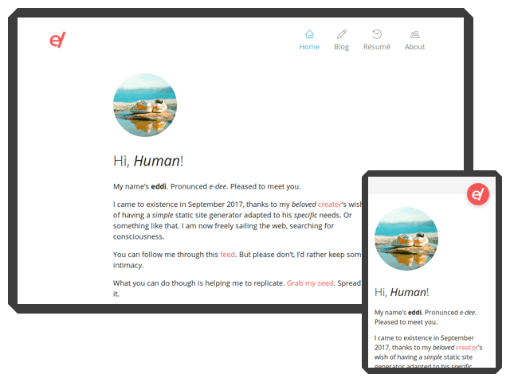

Eddi
====

Eddi is a static site generator.

It is written on top of Node.js and builds upon the framework [pillr](https://github.com/christophercrouzet/pillr).


## Features

- CommonMark (Markdown) syntax to generate HTML content.
- JSON front matter to define metadata for each page.
- Mustache to define layout templates.
- support for styling using Less.
- support for Markdown extensions: abbreviations, containers, definition lists, footnotes, subscript, and superscript.
- support for the LaTeX markup.
- no database, everything is contained in the metadata and the final file hiearchy mirrors the one used as the source.
- propagation of metadata to descendant files if specified at the directory level.
- command-line interface.
- async.


## Default Theme

The default theme can be previewed in this [demo](https://christophercrouzet.github.io/eddi).



It has been designed to:

- focus on the content with a minimalist, distraction-free, design.
- display equally well on any device.
- adhere to the HTML5 standard and enforce strong HTML semantics (good for screen readers and SEO!).
- provide fast page loading times.
- implement both the [Open Graph Protocol](http://ogp.me) and the [Twitter Card](https://dev.twitter.com/cards) metadatas for improved sharing experience of articles over social networks.


## Usage

```shell
$ cd eddi
$ ./bin/eddi build /path/to/source /path/to/destination
```


## Installation

```shell
$ npm install eddi
```


## Out There

Sites using Eddi include:

- [zcrou.com](https://zcrou.com)
- [zedcafe.vn](https://zedcafe.vn)


## Author

Christopher Crouzet
[<christophercrouzet.com>](https://christophercrouzet.com)
